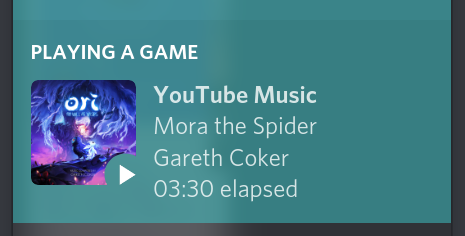

# Discord Rich Presence client for MPRIS players

An attempt to mimicking Spotify's Rich Presence as much as possible.



**Warning!** Requires a user account token and a Rich Presence app on <https://discordapp.com/developers/applications>. User token is used to send data to manage Rich Presence assets which may be seen as a violation of Discord ToS, we don't take responsibility for any accounts banned, proceed at your own risk.

## Supported players
 - [YouTube Music app for Nuvola Apps Service](https://nuvola.tiliado.eu/app/youtube_music)

## Installation

Requires Node.JS and NPM installed: <https://nodejs.org/>

```bash
git clone https://github.com/ruslang02/discord-mpris # Clone the repo
npm install # Install all dependencies
npm run build # Build TypeScript files
```

After this you need to create an application at <https://discordapp.com/developers/applications>. You are also required to add assets (images) with names `playing`, `paused` and `default` (when an album cover does not exist).

Then you need to configure your installation using the `config.js` file, sample of which is located in the `config.sample.js` file. Retrieve your application ID and user token and you should be ready to go.

```bash
npm start # Run the plugin
```

## Alternatives
 - [FichteFoll/discordrp-mpris](https://github.com/FichteFoll/discordrp-mpris), written in Python3, no assets management.
 - [diamondburned/discord-mpris](https://gitlab.com/diamondburned/discord-mpris/), written in Go, very little functionality.

## What is impossible
 - Implementing song's title instead of application's name is not possible due to heavy caching of Rich Presence application information.
 - Listen together, Play on *smth*, fancy progress bar as they are exclusive to Spotify.

## TODO
 - Ability to work without the asset management.
 - Support for other media players, auto-switching.
 - More Oomph!
